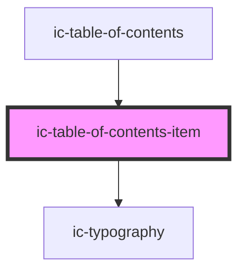

# ic-table-of-contents-item

<!-- Auto Generated Below -->

## Properties

| Property   | Attribute  | Description | Type      | Default     |
| ---------- | ---------- | ----------- | --------- | ----------- |
| `active`   | `active`   |             | `boolean` | `false`     |
| `label`    | `label`    |             | `string`  | `undefined` |
| `position` | `position` |             | `number`  | `0`         |
| `selected` | `selected` |             | `boolean` | `false`     |
| `target`   | `target`   |             | `string`  | `undefined` |
| `truncate` | `truncate` |             | `boolean` | `false`     |
| `variant`  | `variant`  |             | `string`  | `"h3"`      |

## Events

| Event            | Description | Type                  |
| ---------------- | ----------- | --------------------- |
| `contentsScroll` |             | `CustomEvent<number>` |

## Methods

### `setFocus() => Promise<void>`

#### Returns

Type: `Promise<void>`

## Dependencies

### Used by

 - [ic-table-of-contents](../ic-table-of-contents)

### Depends on

- ic-typography

### Graph

----------------------------------------------

