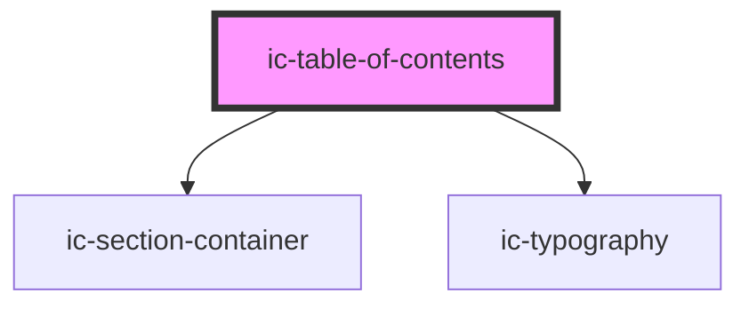

# ic-table-of-contents

<!-- Auto Generated Below -->

## Properties

| Property          | Attribute           | Description | Type                                                  | Default               |
| ----------------- | ------------------- | ----------- | ----------------------------------------------------- | --------------------- |
| `heading`         | `heading`           |             | `string \| undefined`                                 | `"Table of Contents"` |
| `position`        | `position`          |             | `"bottom" \| "left" \| "right" \| "top" \| undefined` | `"right"`             |
| `setClickHeight`  | `set-click-height`  |             | `number`                                              | `75`                  |
| `setScrollHeight` | `set-scroll-height` |             | `number`                                              | `50`                  |
| `size`            | `size`              |             | `"large" \| "medium" \| "small" \| undefined`         | `"medium"`            |
| `theme`           | `theme`             |             | `"dark" \| "inherit" \| "light" \| undefined`         | `"inherit"`           |
| `truncate`        | `truncate`          |             | `boolean \| undefined`                                | `false`               |

## Dependencies

### Depends on

- ic-section-container
- ic-typography

### Graph

----------------------------------------------

